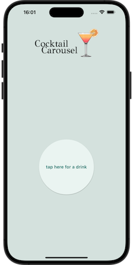
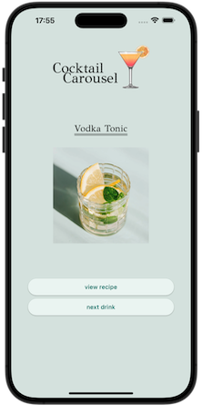
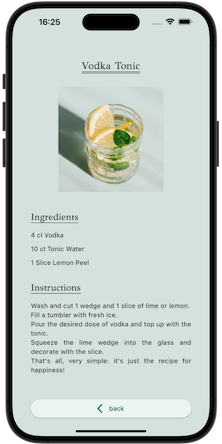
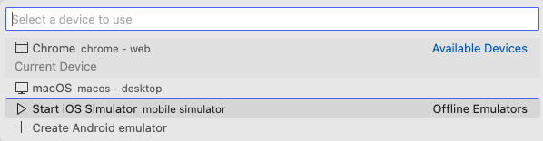

# Cocktail Carousel

An app for viewing drink recipes from the [Cocktail API](https://www.thecocktaildb.com/api.php), created with Flutter. 

## Table of contents
* [Brief](#brief)
* [Images](#images)
* [Technologies](#technologies)
* [Setup](#setup)

## Brief
Create an application using the Flutter framework and Cocktail API.
* It must dynamically pull data from the Cocktail API.
* It should be interactive. It should allow the user to click a button to generate a random cocktail and then, once generated, click another button to view more information about that cocktail on another screen (e.g. recipe and/or ingredients list).

## Images




## Technologies
The project is created with:
* Dart
* Flutter

## Setup
1. Ensure you have the following installed ([installation guide](https://docs.flutter.dev/get-started/install)):
* Dart (3.1.5)
* Flutter (3.13.9)
* Flutter plugin/extension for your IDE
* (Optional) iOS simulator - the app can be run on Chrome but was developed using an iPhone 15 Pro Max simulator and will therefore look its best on a similar device

2. Navigate to the app directory, e.g. in VSCode:
```
$ cd ../cocktail_carousel
```

3. Select a device to use, e.g. in VSCode:



4. Run the file `main.dart` located in the below directory:
```
./lib/main.dart
```

5. The app is now running on your chosen device.